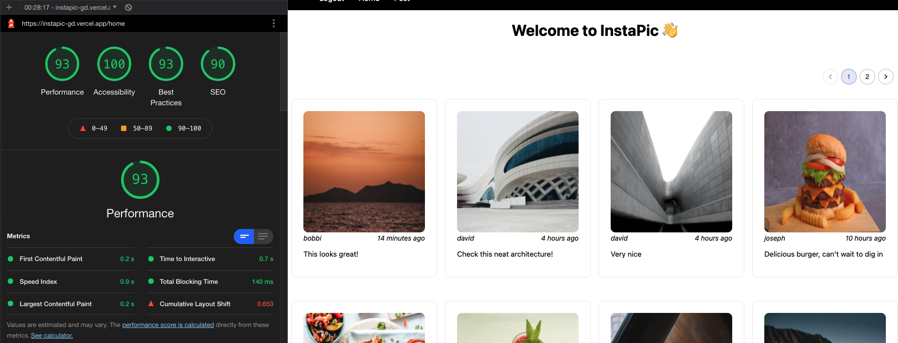

# InstaPic
------------
Image sharing application built with Next.js. 

https://instapic-gd.vercel.app/login

<a aria-label="Vercel logo" href="https://vercel.com">
  
</a>

[](https://github.com/godfreydoo/instapic)

Current functionality includes account registration, uploading a post with an image and description, and view posts with pagination and user filtering. Application is built with [Next.js](https://nextjs.org/), powered by [Vercel](https://vercel.com/)'s serverless functions, and CircleCI for CI/CD. Application has blazing fast load speeds, server-side rendering, and is optimized with caching and indexed database queries ⚡.



# Table of Contents
------------
* [InstaPic](#instapic)
* [Functionality](#functionality)
* [Getting Started](#getting-started)
* [API](#api)
* [Environment Variables](#environment-variables)
* [Other](#other)

## Functionality
------------
Login and registration flow implemented with Passport and next-connect. 


View home feed of posts, able to sort by user and by page. Indexes created on query conditions for optimied queries. Caching implemented to reduce retrieval speed of posts. 


Upload posts to be viewed by other users. 


## Getting Started
------------
1. Fork this repository and clone it to your local disk. Navigate to the project folder on your computer.
2. In the project root directory and client directory, run these commands
```bash
npm install
```
3. Run just one command for client and server. 
```bash
npm run dev
```
4. See [Environment Variables](#environment-variables) below.
5. Navigate to http://localhost:3000
6. Run below for tests:
```bash
npx jest
```

## API
------------
### api/get

Gets all posts from users. 

**Request Params**
| Name          | Type          | Required | Description                                                     |
| ------------- | ------------- | -------- | --------------------------------------------------------------- |
| username      | string        |     N    | Optional. Filters by username; otherwise, gets all data         |
| page          | number        |     N    | Optional. Sets the page, with default count per page of 8 items |


**REST Method**

POST

**Response Attributes**

Array of objects with post data. 

**Request Sample**

`/api/get?username=test&page=1`


</br>


### api/count

Gets total number of posts. 

**REST Method**

GET

**Response Attributes**

Integer

**Request Sample**

`/api/count`

</br>


## Environment Variables
------------
Use the `env.local.example` as reference: 
1. Create a cluster with [Mongo Atlas](https://www.mongodb.com/cloud/atlas) and generate the connection string with your username, password, and database name. Insert the connection string to `MONGODB_URI`. Insert the database name to `MONGODB_DB`.
2. Generate `TOKEN_SECRET` as a secret key for session creation. Open terminal and run command to generate a random hex string.
```bash
node
require('crypto').randomBytes(64).toString('hex')
```
3. Create an account with Cloudinary to host images and copy and paste an unsigned preset
* Cloudinary preset (unsigned) - `CLOUDINARY_PRESET`
* Cloudinary URL - `CLOUDINARY_URL`

The photo upload method is done via a direct call to the Cloudinary REST API. More information can be found here: https://cloudinary.com/documentation/upload_images#uploading_with_a_direct_call_to_the_rest_api


## Other
------------
* Trello: https://treallo.com/b/346dHt72/instapic
* Wireframes: https://whimsical.com/instapic-JmTG26kdyVNWPgjkAq3SyS
